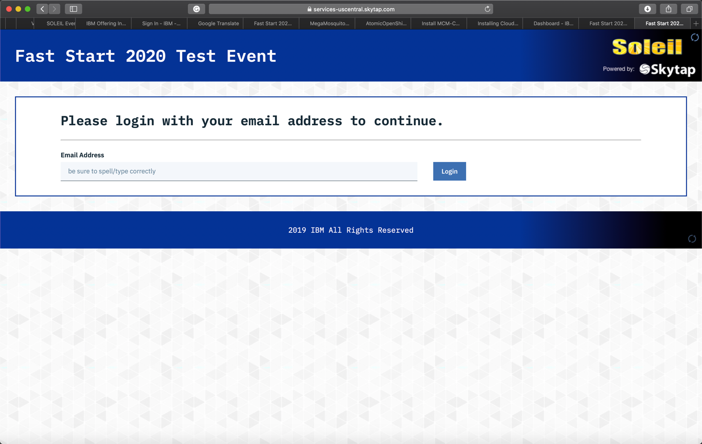
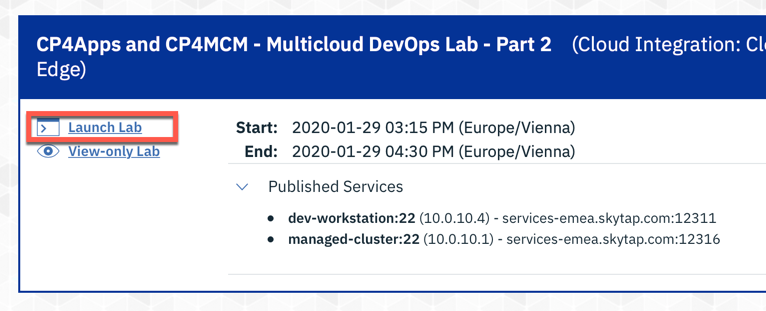
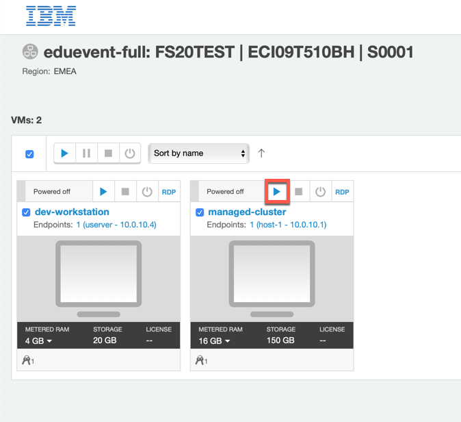
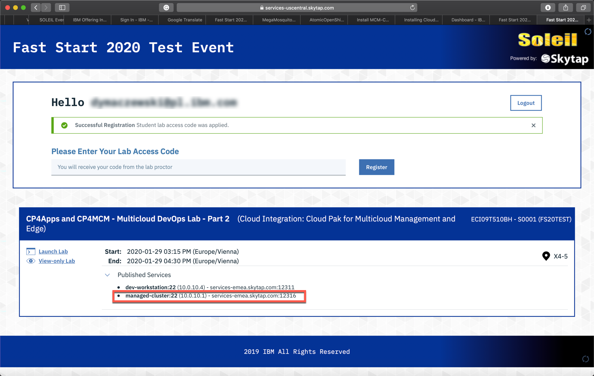
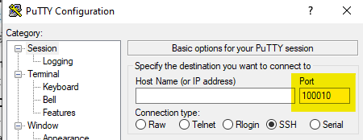

# Accessing the lab environment

[Go back to the Table of Contents](./README.md)

For the FastStart 2020 labs related to the IBM Edge Computing Manager you will be using the central Hub server installed in IBM Cloud. This environment is setup to be multi-tenant where each student has their own userid.  Each student will have their own managed edge cluster in Skytap that you will manage from the centralized Hub server.

<table border="1">
<tr><th colspan="3">Access credentials</th></tr>
<tr><th>Interface</th><th>Username</th><th>Password</th></tr>
<tr><td>IBM Edge Computing Manager User Interface</td><td>assigned to you by lab instructor (<b>userXX</b>)</td><td><b>ReallyStrongPassw0rd</b></td></tr>
<tr><td>managed-cluster VM</td><td><b>localuser</b></td><td><b>passw0rd</b></td></tr>
</table>

## Connecting to the IBM CloudPak for Multicloud Management Hub

To access the Hub cluster open a browser on your workstation and point it to:

<a href="https://fs20edgem.169.62.229.212.nip.io:8443" target="_blank">https://fs20edgem.169.62.229.212.nip.io:8443</a>

**ATTENTION: Lab tutorials were tested with Firefox browser.**

## Connecting to the managed cluster

To access the managed cluster you need a terminal with SSH client. On Mac or Linux workstation use a regular terminal, on Windows use Putty

Open the Session URL given you by instructor. You should see the form similar to the one shown below:



Provide you email address and click **Login**. Then, provide the code given you by instructor and click **Register**


Verify that the environment was started. Click **Launch Lab** link on the left.



If the managed cluster VM is not running start it clicking **Play** button. You can ignore the dev-workstation VM - it won't be used in this lab



<span style="color:red">**IT IS NOT RECOMMENDED TO USE SKYTAP UI TO CONNECT TO THE MACHINE - YOU WILL USE A TERMINAL CONNECTION DIRECTLY FROM YOUR WORKSTATION**</span>

You should see the page that looks like this



Take a note of address and the port number, next to the **managed-cluster** VM. In above example, it is *services-uscentral.skytap.com* and *12316*. It is the SSH port exposed from the virtal machine for your instance.

Open the terminal on your workstation. Connect to the VM using user **localuser** with password **passw0rd**

For Mac and Linux
```
ssh -p <port> localuser@<address>
```

for example:
```
ssh -p 12316 localuser@services-uscentral.skytap.com
```

For Windows use putty



## Copying files between your local workstation and managed-cluster

When you need to copy any file between your local workstation and managed-cluster in Skytap, use the following:

For Mac and  Linux
```
scp -P <port> <source-file> localuser@services-uscentral.skytap.com:<target-path>
```

For Windows use WinSCP or equivalent tool


[Go back to the Table of Contents](./README.md)

<table>
  <tr>
    <td>Version</td>
    <td>1.0</td>
  </tr>
  <tr>
    <td>Author</td>
    <td>Wlodek Dymaczewski, IBM</td>
  </tr>
  <tr>
    <td>email</td>
    <td>dymaczewski@pl.ibm.com</td>
  </tr>
</table>


