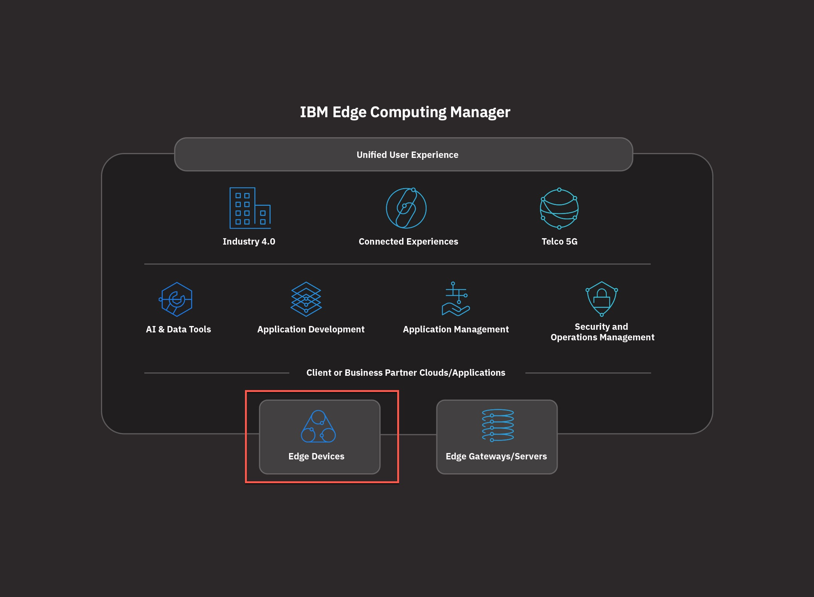
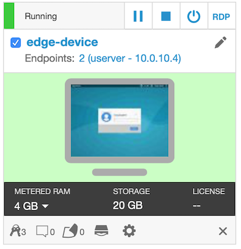
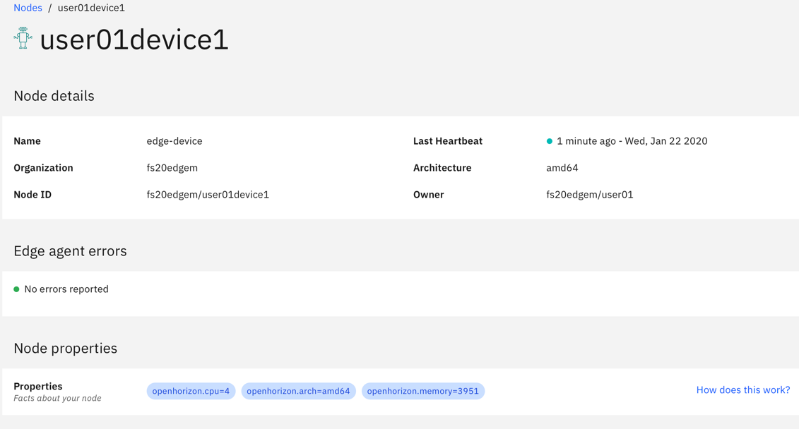
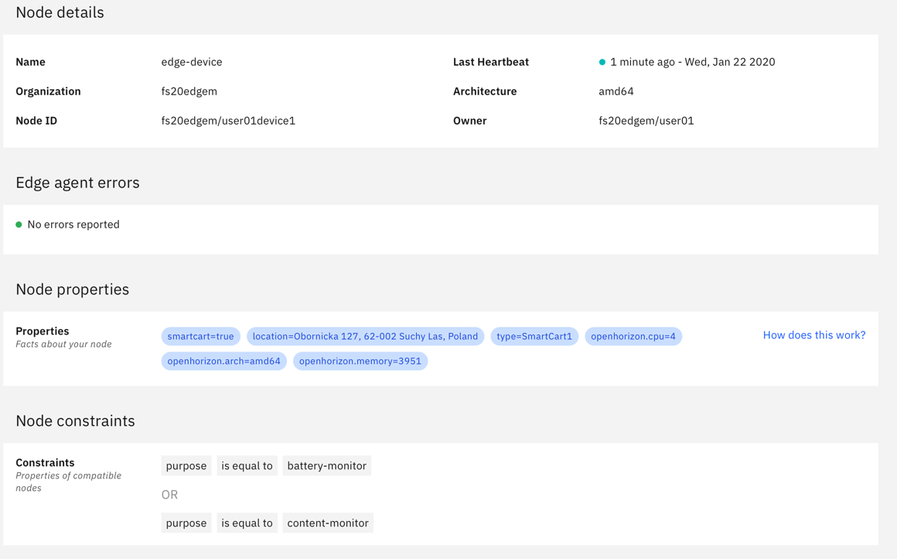
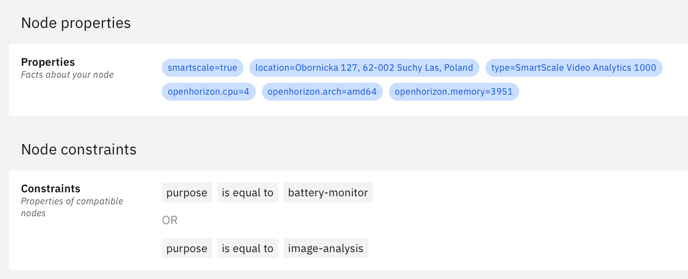
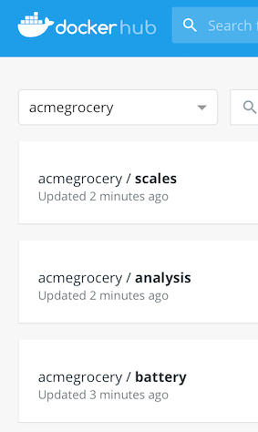

# Edge Device Lab


<!-- TOC -->

- [Edge Device Lab](#edge-device-lab)
  - [WARNING](#warning)
  - [Connect to the Edge Hub Environment](#connect-to-the-edge-hub-environment)
  - [Connect to the Edge Device environment.](#connect-to-the-edge-device-environment)
  - [Setup the environment in your Device VM](#setup-the-environment-in-your-device-vm)
  - [Optionally clean up old deployments](#optionally-clean-up-old-deployments)
  - [Prepare to register the Edge device.](#prepare-to-register-the-edge-device)
  - [Register the Edge device.](#register-the-edge-device)
  - [Optional - Exploring the Edge Device configuration](#optional---exploring-the-edge-device-configuration)
  - [Defining custom properties, constraints and services.](#defining-custom-properties-constraints-and-services)
  - [Node policies](#node-policies)
  - [Adding cart service properties and constraints to the Edge Device](#adding-cart-service-properties-and-constraints-to-the-edge-device)
  - [Check deployed services](#check-deployed-services)
  - [Congrartulations! Your smartcart device is ready to go!](#congrartulations-your-smartcart-device-is-ready-to-go)
  - [Re-registering the node as smartscale](#re-registering-the-node-as-smartscale)
    - [Build Edge service metadata](#build-edge-service-metadata)
    - [Publish the new Edge service](#publish-the-new-edge-service)
    - [Create policies to link Device Nodes to Edge Services.](#create-policies-to-link-device-nodes-to-edge-services)
    - [Service networking](#service-networking)
    - [Summary](#summary)
  - [Diagnostics - for interest](#diagnostics---for-interest)
  - [Optional background steps](#optional-background-steps)
    - [Build the applications and push into DockerHub](#build-the-applications-and-push-into-dockerhub)
    - [Create the new service from a new asset](#create-the-new-service-from-a-new-asset)

<!-- /TOC -->

## WARNING

Stick to the naming convention for all artefacts that you create (adding uxerXX where appropriate) as this is a multi tenant environment. If you do not, this will create problems for you and others.

## Connect to the Edge Hub Environment

The details of the Edge hub server are here.

[IBM Edge Computing Manager console](https://fs20edgem.169.62.229.212.nip.io:8443/edge#/)

After you have authenticated to the Edge Hub Server, you will need to navigate to the Edge management console via `Hamburger Menu` > `Edge Computing`

Credentials for the IBM Edge Computing Manager hub server are **userXX / ReallyStrongPassw0rd**. You will be assigned number between 01 and 50 by lab instructors.

## Connect to the Edge Device environment.

If you haven't done it yet, follow these [instructions](./ConnectToLabEnvrionment.md)

When your `edge-device` is active, then connect via SSH.

Credentials for the Edge Device VM are `localuser / passw0rd`



From a MAC or Linux run the command similar to the following from a local terminal on your workstation

**ATTENTION: Remember to use a port number for you instance of edge-defice VM**

```
ssh localuser@services-uscentral.skytap.com -p 12366
```

for Windows users, then [putty](https://www.chiark.greenend.org.uk/~sgtatham/putty/latest.html) is your friend.

```
macbook:OnTheEdge rhine$ ssh localuser@services-uscentral.skytap.com -p 12366
The authenticity of host '[services-uscentral.skytap.com]:12366 ([184.170.232.54]:12366)' can't be established.
ECDSA key fingerprint is SHA256:KJiu6uE/9Wr2MhDxZ73UGZtXSI2A68j/dlMkWtlKR1Y.
Are you sure you want to continue connecting (yes/no)? yes
Warning: Permanently added '[services-uscentral.skytap.com]:12366,[184.170.232.54]:12366' (ECDSA) to the list of known hosts.
localuser@services-uscentral.skytap.com's password:
Welcome to Ubuntu 16.04.6 LTS (GNU/Linux 4.4.0-159-generic x86_64)

 * Documentation:  https://help.ubuntu.com
 * Management:     https://landscape.canonical.com
 * Support:        https://ubuntu.com/advantage

 * Overheard at KubeCon: "microk8s.status just blew my mind".

     https://microk8s.io/docs/commands#microk8s.status

8 packages can be updated.
8 updates are security updates.


Last login: Thu Dec 19 08:13:17 2019 from 91.223.212.205
localuser@edge-device:~$

```

## Setup the environment in your Device VM

When you start this exercise, there is no Horizon agent installed on this device, but if you need to reset, then run these following 2 command and this will unregister the node from the Edge server and also remove the agent and it's environment artefacts.

## Optionally clean up old deployments

So the following 2 steps will not be necessary when you first start but they will do no harm, and you might want to reset your environment later in the lab.

1. Unregister the agent from the Edge Hub

```
hzn unregister -D -r

Are you sure you want to unregister this Horizon node? [y/N]: y
Unregistering this node, cancelling all agreements, stopping all workloads, and restarting Horizon...
Waiting for Horizon node unregister to complete: No Timeout specified ...
Checking the node configuration state...
Horizon node unregistered. You may now run 'hzn register ...' again, if desired.
```
2. Remove the agent environment.

```
ocaluser@edge-device:~/horizon-edge-packages$ sudo ./uninstall.sh
[sudo] password for localuser:
*INFO* Start
*INFO* removing bluehorizon horizon-cli and the agent default values.
*INFO* also resetting the agent configuration to its base values
Reading package lists... Done
Building dependency tree       
Reading state information... Done
Package 'bluehorizon' is not installed, so not removed
0 upgraded, 0 newly installed, 0 to remove and 4 not upgraded.
*INFO* removed horizon-cli RC 0
Reading package lists... Done
Building dependency tree       
Reading state information... Done
Package 'horizon-cli' is not installed, so not removed
0 upgraded, 0 newly installed, 0 to remove and 4 not upgraded.
*INFO* removed horizon-cli RC 0
*INFO* removing /etc/default/horizon, resetting agent-install.cfg and removing the Edge Hub Certificate
rm: cannot remove '/etc/default/horizon': No such file or directory
*INFO* Done
```
## Prepare to register the Edge device.

Follow the instruction working in the terminal window connected to the edge-device VM.

Binaries for the edge device agent are already copied to your device, you can find them in `~/horizon-edge-packages`

In order to register edge-device VM as a managed edge device you need 2 additional items:
- api key
- CA certificate for the IBM Edge Computing Manager hub environment

`cloudctl` and `kubectl` are already installed in this VM, but if you are working from your own MAC laptop, then you will find the binaries [here](https://169.62.229.212:8443/console/tools/cli). You can of course us your existing workstation if you have the clients installed.

Authenticate to the Kubernetes server hosting the Edge Hub

```
localuser@edge-device:~$ cloudctl login -a  https://fs20edgem.169.62.229.212.nip.io:8443 -u user01 -p ReallyStrongPassw0rd --skip-ssl-validation -n user01
Authenticating...
OK

Targeted account fs20edgem Account (id-fs20edgem-account)

Targeted namespace team01

Configuring kubectl ...
Property "clusters.fs20edgem" unset.
Property "users.fs20edgem-user" unset.
Property "contexts.fs20edgem-context" unset.
Cluster "fs20edgem" set.
User "fs20edgem-user" set.
Context "fs20edgem-context" created.
Switched to context "fs20edgem-context".
OK

Configuring helm: /home/localuser/.helm
OK

```
We need to generate a Kubernetes API key that will be used when the horizon agent connects to the hub. Make your key name unique as this is a multi tenant environment.

```
cloudctl iam api-key-create user01 -d "FastStart 2020 Edge User01 API Key" -f edge-api-key
Creating API key user01 as user01...
OK
API key user01 created
Successfully saved API key information to edge-api-key

localuser@edge-device:~$ cat edge-api-key
{
	"name": "user01",
	"description": "FastStart 2020 Edge User01 API Key",
	"apikey": "iX0hMrFw9xlN4m1E9XQC6-MDBLsQdu9PVeHm-I9Vwji9",
	"createdAt": "2020-01-10T13:17+0000"
}

```
Take the `apikey` value from the `edge-api-key` file and update the `HZN_EXCHANGE_USER_AUTH` variable value in `agent-install.cfg` located in `horizon-edge-packages` directory.

something like ...

```
HZN_EXCHANGE_USER_AUTH=iamapikey:<your key>
e.g.
HZN_EXCHANGE_USER_AUTH=iamapikey:iX0hMrFw9xlN4m1E9XQC6-MDBLsQdu9PVeHm-I9Vwji9
```

Get a certificate from the Edge hub and make it available to agent commands. This certificate is used in the communication from the Edge device agent to the Edge Hub.

```
kubectl --namespace kube-system get secret cluster-ca-cert -o jsonpath="{.data['tls\.crt']}" | \
base64 --decode > /home/localuser/horizon-edge-packages/agent-install.crt
```
Add a `HZN_DEVICE_ID` variable value to `agent-install.cfg` and make it unique, as this will make it easier to find your device in the Web console.

When you are ready to register the device to the hub, your `agent-install.cfg` should look something like ...

```
localuser@edge-device:~/horizon-edge-packages$ cat agent-install.cfg
HZN_EXCHANGE_URL=https://fs20edgem.169.62.229.212.nip.io:8443/ec-exchange/v1
HZN_FSS_CSSURL=https://fs20edgem.169.62.229.212.nip.io:8443/ec-css
HZN_ORG_ID=fs20edgem
HZN_DEVICE_ID=user01device1
HZN_EXCHANGE_USER_AUTH=iamapikey:iX0hMrFw9xlN4m1E9XQC6-MDBLsQdu9PVeHm-I9Vwji9
```
<span style="color:red">ATTENTION: Make sure that you precede your API key with `'iamapikey:'`</span>

copy this file to `/etc/default/horizon` to provide system wide defaults.

`sudo cp agent-install.cfg /etc/default/horizon`

## Register the Edge device.

The variable values for the installation are provided from the `agent-install.cfg` file, but you can control the installation as follows if required.

```
./agent-install.sh -h
agent-install.sh <options> -- installing Horizon software
where:
    $HZN_EXCHANGE_URL, $HZN_FSS_CSSURL, $HZN_ORG_ID, $HZN_EXCHANGE_USER_AUTH variables must be defined either in a config file or environment,

    -c          - path to a certificate file
    -k          - path to a configuration file (if not specified, uses agent-install.cfg in current directory, if present)
    -p          - pattern name to register with (if not specified, registers node w/o pattern)
    -i          - installation packages location (if not specified, uses current directory)
    -n          - path to a node policy file
    -s          - skip registration
    -v          - show version
    -l          - logging verbosity level (0-5, 5 is verbose)
```
We just looking for critical errors at installation time so we will use minimal agent verbosity ...

```
sudo ./agent-install.sh -l 1

EXTRACT FOLLOWS, SOME LINES DELETED

2020-01-10 05:48:23 the service is not ready, will retry in 1 second
2020-01-10 05:48:24 The service is ready
2020-01-10 05:48:24 Generated node token is
OwygvdzYd0GhS27ZcIYTUxFEo0g4luX1lduniCLzQCZXF
2020-01-10 05:48:24 Creating a node...
+ hzn exchange node create -n user01device1:OwygvdzYd0GhS27ZcIYTUxFEo0g4luX1lduniCLzQCZXF -m edge-device -o fs20edgem -u iamapikey:iX0hMrFw9xlN4m1E9XQC6-MDBLsQdu9PVeHm-I9Vwji9
+ set +x
2020-01-10 05:48:24 Verifying a node...
+ hzn exchange node confirm -n device1:OwygvdzYd0GhS27ZcIYTUxFEo0g4luX1lduniCLzQCZXF -o fs20edgem
Node id and token are valid.
+ set +x
2020-01-10 05:48:24 Registering node...
+ hzn register -m edge-device -o fs20edgem -u iamapikey:iX0hMrFw9xlN4m1E9XQC6-MDBLsQdu9PVeHm-I9Vwji9 -n user01device1:OwygvdzYd0GhS27ZcIYTUxFEo0g4luX1lduniCLzQCZXF
Horizon Exchange base URL: https://fs20edgem.169.62.229.212.nip.io:8443/ec-exchange/v1
Node fs20edgem/user01device1 exists in the exchange
No pattern or node policy is specified. Will proceed with the existing node policy.
Initializing the Horizon node...
Warning: no input file was specified. This is only valid if none of the services need variables set (including GPS coordinates).
Changing Horizon state to configured to register this node with Horizon...
Horizon node is registered. Workload agreement negotiation should begin shortly. Run 'hzn agreement list' to view.
```

There are no `agreements` between the device and the hub at this point

```
hzn agreement list
[]
```
Check in the Hub that your device has been registered OK


Note also that when you explore the device node details from the hub GUI that there are no constraints and we only have simple properties.



## Optional - Exploring the Edge Device configuration

Agent installation packages

`tree` is not installed by default. If you need it, then `sudo apt install -y tree` will complete an installation.

```
cd /home/localuser/horizon-edge-packages

localuser@edge-device:~/horizon-edge-packages$ tree
.
├── agent-install.cfg
├── agent-install.crt
├── agent-install.sh
├── linux
│   ├── raspbian
│   │   └── stretch
│   │       └── armhf
│   │           ├── bluehorizon_2.23.30~v3.2.1~ppa~raspbian.stretch_all.deb
│   │           ├── horizon_2.23.30~v3.2.1~ppa~raspbian.stretch_armhf.deb
│   │           └── horizon-cli_2.23.30~v3.2.1~ppa~raspbian.stretch_armhf.deb
│   └── ubuntu
│       ├── bionic
│       │   ├── amd64
│       │   │   ├── bluehorizon_2.23.30~v3.2.1~ppa~ubuntu.bionic_all.deb
│       │   │   ├── horizon_2.23.30~v3.2.1~ppa~ubuntu.bionic_amd64.deb
│       │   │   └── horizon-cli_2.23.30~v3.2.1~ppa~ubuntu.bionic_amd64.deb
. some lines deleted here!
│       └── xenial
│           ├── amd64
│           │   ├── bluehorizon_2.23.30~v3.2.1~ppa~ubuntu.xenial_all.deb
│           │   ├── horizon_2.23.30~v3.2.1~ppa~ubuntu.xenial_amd64.deb
│           │   └── horizon-cli_2.23.30~v3.2.1~ppa~ubuntu.xenial_amd64.deb
. some lines deleted here!
├── macos
│   ├── horizon-cli-2.23.30-v3.2.1.pkg
│   └── horizon-cli.crt
├── README.md
└── set_env.sh

```
explore the `agent-install.cfg` file for the details of the Edge Management server connection. Yours may be different in the lab environment you are using.

```
localuser@edge-device:~/horizon-edge-packages$ cat agent-install.cfg
HZN_EXCHANGE_URL=https://fs20edgem.169.62.229.212.nip.io:8443/ec-exchange/v1
HZN_FSS_CSSURL=https://fs20edgem.169.62.229.212.nip.io:8443/ec-css
HZN_ORG_ID=fs20edgem
HZN_DEVICE_ID=user01device1
HZN_EXCHANGE_USER_AUTH=iamapikey:iX0hMrFw9xlN4m1E9XQC6-MDBLsQdu9PVeHm-I9Vwji9
```

We use the Horizon client to interact with our Edge device and it's relationship with the Edge server.

Q. What is the status of our edge infrastructure deployment?
```
localuser@edge-device:~/horizon-edge-packages$ hzn status|grep -i status
      "status": "terminated",
      "subworker_status": {}
      "status": "initialized",
      "subworker_status": {
      "status": "initialized",
      "subworker_status": {}
      "status": "initialized",
      "subworker_status": {}
      "status": "initialized",
      "subworker_status": {
      "status": "initialized",
      "subworker_status": {}
      "status": "initialized",
      "subworker_status": {}
      "status": "initialized",
      "subworker_status": {}
```
A. All is well.

Q. What `agreements` do we have between the `IBM Edge Computing Manager hub` and the `edge device`?
```
localuser@edge-device:~/horizon-edge-packages$ hzn agreement list
[]
localuser@edge-device:~/horizon-edge-packages$
```
A. No agreements shown above as there are no negotiated contracts between node and the hub.

## Defining custom properties, constraints and services.

Now we are going to add some properties and constraints to the device node and use them to bind them to some new services.

Firstly, copy the lab assets to your VM.

```
cd ~ && git clone https://github.com/rhine59/EdgeLabStudentFiles.git
Cloning into 'EdgeLabStudentFiles'...
```

## Node policies

## Adding cart service properties and constraints to the Edge Device

You will use the installation script again, so there is no need to unregister the device first (agent-install.sh does it for you), just run the script again using the new JSON node policy file as a parameter.

`cd ~/horizon-edge-packages`

Have a look at the new properties and constraints that we are about to give our Edge Device.
You can use your own `location` property value.

```
{
    "properties": [   /* A list of policy properties that describe the object. */
      {"name": "smartcart","value": true},
      {"name": "location", "value": "Obornicka 127, 62-002 Suchy Las, Poland"},
      {"name": "type", "value": "SmartCart1"}
    ],
    "constraints": [  /* A list of constraint expressions of the form <property name> <operator> <property value>, separated by boolean o
  perators AND (&&) or OR (||). */
      "purpose == battery-monitor OR purpose == content-monitor"
    ]
  }
```
Now re-register the device with these properties.

`sudo ./agent-install.sh -l 1 -n ../EdgeLabStudentFiles/smartcart/smartcart-node-registration.json`

```
Node policy: ../EdgeLabStudentFiles/smartcart/smartcart-node-registration.json
2020-01-10 07:03:53 You node is registered
Do you want to overwrite the current node configuration?[y/N]:
y
2020-01-10 07:03:57 The configuration will be overwritten...
2020-01-10 07:04:01 Versions are equal: agent is 2.23.30 and packages are
2.23.30. Don't need to install
+ hzn unregister -rf
Unregistering this node, cancelling all agreements, stopping all workloads, and restarting Horizon...
Waiting for Horizon node unregister to complete: No Timeout specified ...
Checking the node configuration state...
Horizon node unregistered. You may now run 'hzn register ...' again, if desired.
+ systemctl restart horizon.service
2020-01-10 07:04:19 the service is not ready, will retry in 1 second
2020-01-10 07:04:21 The service is ready
2020-01-10 07:04:21 Creating a node...
+ hzn exchange node create -n user01device1:C0F0UBaw9j5EczK5bhLlDXOaLLp8gjcV9WVdmSA66Y6MP -m edge-device -o fs20edgem -u iamapikey:iX0hMrFw9xlN4m1E9XQC6-MDBLsQdu9PVeHm-I9Vwji9
2020-01-10 07:04:21 Verifying a node...
+ hzn exchange node confirm -n user01device1:C0F0UBaw9j5EczK5bhLlDXOaLLp8gjcV9WVdmSA66Y6MP -o fs20edgem
Node id and token are valid.
2020-01-10 07:04:22 Registering node...
+ hzn register -m edge-device -o fs20edgem -u iamapikey:iX0hMrFw9xlN4m1E9XQC6-MDBLsQdu9PVeHm-I9Vwji9 -n user01device1:C0F0UBaw9j5EczK5bhLlDXOaLLp8gjcV9WVdmSA66Y6MP --policy ../EdgeLabStudentFiles/smartcart/smartcart-node-registration.json
Node fs20edgem/device1 exists in the exchange
Will proceeed with the given node policy.
Updating the node policy...
Initializing the Horizon node...
Horizon node is registered. Workload agreement negotiation should begin shortly. Run 'hzn agreement list' to view.
```
Success again - check the details of your node in the Edge Hub GUI and note the `properties ` and `constraints`

**NOTE** We could have used the `hzn register` command instead of the `agent-install.sh` command. You will use that method later.



## Check deployed services

Now, verify what services are running on the device.

```
hzn agreement list
[
  {
    "name": "Policy for fs20edgem/user01device1 merged with fs20edgem/battery_deployment",
    "current_agreement_id": "f1b5a6fcde55da5a31be7392d15950d0c4d1662bd3b082370fdd2092f40454b1",
    "consumer_id": "IBM/fs20edgem-agbot",
    "agreement_creation_time": "2020-01-22 11:55:19 -0800 PST",
    "agreement_accepted_time": "2020-01-22 11:55:29 -0800 PST",
    "agreement_finalized_time": "2020-01-22 11:55:29 -0800 PST",
    "agreement_execution_start_time": "2020-01-22 11:55:30 -0800 PST",
    "agreement_data_received_time": "",
    "agreement_protocol": "Basic",
    "workload_to_run": {
      "url": "battery-service",
      "org": "fs20edgem",
      "version": "1.0.0",
      "arch": "amd64"
    }
  },
  {
    "name": "Policy for fs20edgem/user01device1 merged with fs20edgem/smartcart_deployment",
    "current_agreement_id": "26f52ed4b83164817cd633d69929edc22749893cd26ea01cfa7124c7da3eec85",
    "consumer_id": "IBM/fs20edgem-agbot",
    "agreement_creation_time": "2020-01-22 12:14:52 -0800 PST",
    "agreement_accepted_time": "2020-01-22 12:15:02 -0800 PST",
    "agreement_finalized_time": "2020-01-22 12:15:03 -0800 PST",
    "agreement_execution_start_time": "2020-01-22 12:15:04 -0800 PST",
    "agreement_data_received_time": "",
    "agreement_protocol": "Basic",
    "workload_to_run": {
      "url": "smartcart-service",
      "org": "fs20edgem",
      "version": "1.0.0",
      "arch": "amd64"
    }
  }
]
```

After a while, you should see the two agreements which refelct two services being deployed on the device. Verify that they are actually running with the following command:

```
docker ps
CONTAINER ID        IMAGE                           COMMAND                  CREATED             STATUS              PORTS               NAMES
b9f30198fa16        acmegrocery/analysis_amd64:v1   "docker-entrypoint.s…"   8 minutes ago       Up 8 minutes        8081/tcp            26f52ed4b83164817cd633d69929edc22749893cd26ea01cfa7124c7da3eec85-smartcart-service
b54f692f2003        acmegrocery/battery_amd64:v1    "docker-entrypoint.s…"   28 minutes ago      Up 28 minutes       8080/tcp            f1b5a6fcde55da5a31be7392d15950d0c4d1662bd3b082370fdd2092f40454b1-battery_service
```

## Congrartulations! Your smartcart device is ready to go!

Now, let's explore in more details how to build and deploy a service using a smartscale as example. In the real world the smart devices are usually dedicated hardware devices. For our lab we will repurpose the edge-device VM and you will observe
what happens to agreements and services running on the node.

## Re-registering the node as smartscale

The scenario here is that we now want to run some `intelligent grocery scales` software on our Edge device rather than just running some software that will just keep track of the items purchase in the shopping trolley.

Look at the `/home/localuser/EdgeLabStudentFiles/smartscale/smartscale-node-registration.json` file and you will see that `nodes` registered using this file will have two business purposes.

1. To run a `battery-monitor` service
2. To run an `image-analysis` service

```
localuser@edge-device:~/EdgeLabStudentFiles/smartscale$ cat smartscale-node-registration.json
{
    "properties": [   /* A list of policy properties that describe the object. */
      {"name": "smartscale", "value": true},
      {"name": "user", "value": "userXX"},
      {"name": "location", "value": "Obornicka 127, 62-002 Suchy Las, Poland"},
      {"name": "type", "value": "SmartScale Video Analytics 1000"}
    ],
    "constraints": [  /* A list of constraint expressions of the form <property name> <operator> <property value>, separated by boolean o
  perators AND (&&) or OR (||). */
      "purpose == battery-monitor OR purpose == image-analysis"
    ]
  }
```

**Important!!! Edit the `smartscale-node-registration.json` and replace `userXX` with your userid!**

So now we will re-register our Edge device with these new properties. We have done this earlier, so I will not include the verbose command output here.

`sudo ./agent-install.sh -l 1 -n ../EdgeLabStudentFiles/smartscale/smartscale-node-registration.json`

Check the attributes of the `device` from the IBM Edge Computing Manager user interface and see how they have changed.



Use what you have already learned to create, investigate and diagnose

1. What are the new agreements established between the Edge Server and the Edge Device ?
2. Why has my `smartcart-service` still running on my `device` ?
3. Why is the `battery-service` still running on my `device` ?

For the sake of time, we are now going to create new service based on docker images that have already been loaded into DockerHub as below. You can find the detailed instruction on building a docker images for edge computing [here](https://github.com/open-horizon/examples/blob/master/edge/services/helloworld/CreateService.md#build-publish-your-hw)



We will use one of these for our Edge service rather than spend the time creating new one.

### Build Edge service metadata

Create a key pair so that we can sign our work. These can be anything you require, so suggest that you use `fs20edgem` and `<your_userid>` in the place of `organisation` and `unit.`

change `hzn key create "organisation" "unit"` to something like `hzn key create "fs20edgem" "<your_userid>"` and execute ...

```
hzn key create "fs20edgem" "user01"`

Creating RSA PSS private and public keys, and an x509 certificate for distribution. This is a CPU-intensive operation and, depending on key length and platform, may take a while. Key generation on an amd64 or ppc64 system using the default key length will complete in less than 1 minute.
Created keys:
 	/home/localuser/.hzn/keys/service.private.key
	/home/localuser/.hzn/keys/service.public.pem
```

We now need to create some metadata that is used to define our new service to the Edge hub

***IMPORTANT***

Make your userid a part of the `service` name to make it unique! Add your assigned userid e.g. `user01` to the `service` name.

```
cd ~/EdgeLabStudentFiles/smartscale/smartscale-service
source /etc/default/horizon
hzn dev service new -s user01-smartscale-service -i "acmegrocery/scales_amd64"
Created image generation files in /home/localuser/EdgeLabStudentFiles/smartscale/smartscale-service and horizon metadata files in /home/localuser/EdgeLabStudentFiles/smartscale/smartscale-service/horizon. Edit these files to define and configure your new service.
```
You will need to change these generated files - read on!

We have already built the docker images for this exercise and placed them in docker hub. If you want to look at the source code and the build scripts, then look in the `build` directory under each of the service directories.

Modify `hzn.json` to use the appropriate docker image and change the `service.definition.json` file to pick the docker image tag.

Later on, if you are going to experiment with service upgrades, you can change the tags, but for now, stick with `v1`.


Edit `~/EdgeLabStudentFiles/smartscale/smartscale-service/horizon/hzn.json` to match the following content
<pre>
{
    "HZN_ORG_ID": "fs20edgem",
    "MetadataVars": {
        "DOCKER_IMAGE_BASE": "acmegrocery/scales",
        "SERVICE_NAME": "<span style=color:red>user01</span>-smartscale-service",
        "SERVICE_VERSION": <b>"1.0.0"</b>
    }
}
</pre>


Edit `~/EdgeLabStudentFiles/smartscale/smartscale-service/horizon/service.definition.json` to match the following content

<pre>
{
    "org": "$HZN_ORG_ID",
    "label": "$SERVICE_NAME for $ARCH",
    "description": "",
    "public": true,
    "documentation": "",
    "url": "$SERVICE_NAME",
    "version": "$SERVICE_VERSION",
    "arch": "$ARCH",
    "sharable": "multiple",
    "requiredServices": [],
    "userInput": [],
    "deployment": {
        "services": {
            "<span style=color:red>user01</span>-smartscale-service": {
                "image": "${DOCKER_IMAGE_BASE}:v1",
                "privileged": false
            }
        }
    }
}

</pre>

Make sure that **userXX** matches your userid.

As the service policy does not have to be unique, copy the file that we provided you with the following command
```
cp ~/EdgeLabStudentFiles/smartscale/smartscale-service/service.policy.json \
~/EdgeLabStudentFiles/smartscale/smartscale-service/horizon
```

### Publish the new Edge service

We now need to publish this new service to the IBM Edge Computing Manager hub

```
cd ~/EdgeLabStudentFiles/smartscale/smartscale-service/horizon

hzn exchange service publish -O -I -f service.definition.json -p service.policy.json -v

SOME LINES REMOVED BELOW.

Creating user01-service-scale_1.0.0_amd64 in the exchange...
If you haven't already, push your docker images to the registry:
  docker push acmegrocery/scales_amd64:v1
Adding service policy for service: fs20edgem/user01-service-scale_1.0.0_amd64
Updating Service policy  and re-evaluating all agreements based on this Service policy. Existing agreements might be cancelled and re-negotiated.
Service policy updated.
Service policy added for service: fs20edgem/user01-service-scale_1.0.0_amd64
```

Optionally, you can repeat this process for to create a V2 of the service. You need to publish a `V1` and a `V2` version of the service if you would like to explore upgrading services on Edge Devices.

You may optionally chose to publish a `V1` and a `V2` version of each service if you would like to explore upgrading services on Edge Devices.

```
Directory                         | Service                      | Version | Image    | Tags    | Port | Mapped to |
----------------------------------|------------------------------|---------|----------|---------|------|-----------|--
smartcart/battery-monitor-service | battery-service              | 1.0.0   | battery  | V1 & V2 | 8080 | 2020      |
smartcart/smartcart-service       | <userXX>-smartcart-service   | 1.0.0   | analysis | V1 & V2 | 8081 | 2021      |
smartscale/smartscale-service     | <userXX>-smartscale-service  | 1.0.0   | scales   | V1 & V2 | 8082 | 2022      |
```

We already have the containerised software built and waiting in DockerHub and earlier in this topic, we created a `service` for this capability. If you skipped this step, then retrace your steps and do it now.

When complete, have a look in the IBM Edge Computing Manager hub console and you will see your new Service


### Create policies to link Device Nodes to Edge Services.

You have created a service definition, now it is time to bind the service to your device.

Click `userXX-smartscale-service` in the Edge Hub UI. If you cannot find it in the tile view, switch to the list view or use a `Find service` field.


In the service details view, scroll down. Under `Deployment Policies` select `Create Deployment Policy`


Provide some basic details, policy name (make it unique with your userid) and description


after selecting `next` we need to provide the `constraints` that bind the nodes to the services.

Remember the node properties attached to when the node was registered?

```
localuser@edge-device:~/EdgeLabStudentFiles/smartscale$ cat smartscale-node-registration.json
{
    "properties": [   /* A list of policy properties that describe the object. */
      {"name": "smartscale", "value": true},
      {"name": "user", "value": "userXX"},
      {"name": "location", "value": "Obornicka 127, 62-002 Suchy Las, Poland"},
      {"name": "type", "value": "SmartScale Video Analytics 1000"}
    ],
    "constraints": [  /* A list of constraint expressions of the form <property name> <operator> <property value>, separated by boolean o
  perators AND (&&) or OR (||). */
      "purpose == battery-monitor OR purpose == image-analysis"
    ]
  }
```

Select `smartcart` .... `is equal to` .... `true` as a property. Click `+` sign and add also `user` `is equal to` `userXX`.


and select `user` ..... `is equal to` ...... `userXX` where `XX` is your userid. In this way, the `service` that you created will now bind to your `node`. Take a minute to understand this.

Just select `Next` to continue


and `Next` again (there is no need to modify anything in this step)

Finally, `Deploy Service`


Now, let's verify if you haven't made any typo :)

On the edge device run `hzn agreement list`.

After the deployment policy has been completed, look at the details. In particular - check that we have a `time` in the `agreement_execution_start_time` value.

As both the `battery` and the `smartscale` services are matching constraints, you will see one agreement for each service for which you have a matching deployment policy.

```
localuser@edge-device:~/EdgeLabStudentFiles/smartcart/battery-monitor-service$ hzn agreement list
[
  {
    "name": "Policy for fs20edgem/user01device1 merged with fs20edgem/user01-smartscale-deployment",
    "current_agreement_id": "21f41910cb786effcbef605f3ddb4aacc310bbbb4d7e22bad38413df0b479539",
    "consumer_id": "IBM/fs20edgem-agbot",
    "agreement_creation_time": "2020-01-22 14:26:48 -0800 PST",
    "agreement_accepted_time": "2020-01-22 14:26:58 -0800 PST",
    "agreement_finalized_time": "2020-01-22 14:26:58 -0800 PST",
    "agreement_execution_start_time": "2020-01-22 14:27:01 -0800 PST",
    "agreement_data_received_time": "",
    "agreement_protocol": "Basic",
    "workload_to_run": {
      "url": "user01-service-scale",
      "org": "fs20edgem",
      "version": "1.0.0",
      "arch": "amd64"
    }
  },
  {
    "name": "Policy for fs20edgem/user01device1 merged with fs20edgem/battery_deployment",
    "current_agreement_id": "02806edc799363d57241776d69d6d386f18dd057024b15d61a0652bf899dcb8c",
    "consumer_id": "IBM/fs20edgem-agbot",
    "agreement_creation_time": "2020-01-22 14:33:39 -0800 PST",
    "agreement_accepted_time": "2020-01-22 14:33:49 -0800 PST",
    "agreement_finalized_time": "2020-01-22 14:33:50 -0800 PST",
    "agreement_execution_start_time": "2020-01-22 14:33:52 -0800 PST",
    "agreement_data_received_time": "",
    "agreement_protocol": "Basic",
    "workload_to_run": {
      "url": "battery-service",
      "org": "fs20edgem",
      "version": "1.0.0",
      "arch": "amd64"
    }
  }
]
```
So we have deployed the `battery` and the `smartcart` services when we initially registered the `device`, but now that we have a new `service` and a new `node` property, we should have `battery` and the `smartscale` running on the node

Use the `hzn`, `docker` `netstat` and `curl` commands to investigate.

Look for the running Docker containers ...

```
localuser@edge-device:~/EdgeLabStudentFiles/smartcart/battery-monitor-service$ docker ps
CONTAINER ID        IMAGE                          COMMAND                  CREATED             STATUS              PORTS                    NAMES
f5a071b31f25        acmegrocery/battery_amd64:v1   "docker-entrypoint.s…"   6 minutes ago       Up 6 minutes        0.0.0.0:8080->8080/tcp   02806edc799363d57241776d69d6d386f18dd057024b15d61a0652bf899dcb8c-battery_service
a7f33de7a84d        acmegrocery/scales_amd64:v1    "docker-entrypoint.s…"   13 minutes ago      Up 13 minutes       8082/tcp                 21f41910cb786effcbef605f3ddb4aacc310bbbb4d7e22bad38413df0b479539-user01-smartscale-service
```
You can see above that we have deployed the 2 docker containers associated with our 2 services.

### Service networking

If you look at the battery container, you see that port `8080` is mapped to all interfaces on the host machine. This means that we can access the battery `service` externally, but NOT the smartscale `service`.

This is controlled in the `service.definition.json` for the `service` in the `deployment` stanza. Have a look [here](https://github.com/open-horizon/anax/blob/master/doc/deployment_string.md) for what else can be controlled.

Look at the service definition json files for the `battery` and the `smartcart` services to understand how we have defined them differently.

If I try to connect to the port for the 2 services externally, you will see the difference

```
curl -i localhost:8080
HTTP/1.1 200 OK
X-Powered-By: Express
Content-Type: text/html; charset=utf-8
Content-Length: 22
ETag: W/"16-6FkC70SDuBHHlB6EaeGUaipvwbA"
Date: Wed, 22 Jan 2020 21:21:44 GMT
Connection: keep-alive

V1 battery famous-fun

curl -i localhost:8082
curl: (7) Failed to connect to localhost port 8081: Connection refused
```
The program source for these containers can be found here.

[battery](https://github.com/rhine59/EdgeLabStudentFiles/tree/master/smartcart/battery-monitor-service/build)

and

[smartscale](https://github.com/rhine59/EdgeLabStudentFiles/tree/master/smartscale/smartscale-service/build)

Take time to understand how we achieved this.

What is happening with our Edge node?

Take some time to investigate and understand the logs.

```
localuser@edge-device:~/horizon-edge-packages$ hzn eventlog list
[
  "2020-01-22 14:21:03:   Start node configuration/registration for node user01device1.",
  "2020-01-22 14:21:04:   Complete node configuration/registration for node user01device1.",
  "2020-01-22 14:26:48:   Node received Proposal message using agreement 21f41910cb786effcbef605f3ddb4aacc310bbbb4d7e22bad38413df0b479539 for service fs20edgem/user01-service-scale from the agbot IBM/fs20edgem-agbot.",
  "2020-01-22 14:26:58:   Agreement reached for service user01-service-scale. The agreement id is 21f41910cb786effcbef605f3ddb4aacc310bbbb4d7e22bad38413df0b479539.",
  "2020-01-22 14:26:58:   Start dependent services for fs20edgem/user01-service-scale.",
  "2020-01-22 14:26:58:   Start workload service for fs20edgem/user01-service-scale.",
  "2020-01-22 14:27:01:   Image loaded for fs20edgem/user01-service-scale.",
  "2020-01-22 14:27:01:   Workload service containers for fs20edgem/user01-service-scale are up and running.",
  "2020-01-22 14:33:39:   Node received Proposal message using agreement 02806edc799363d57241776d69d6d386f18dd057024b15d61a0652bf899dcb8c for service fs20edgem/battery-service from the agbot IBM/fs20edgem-agbot.",
  "2020-01-22 14:33:49:   Agreement reached for service battery-service. The agreement id is 02806edc799363d57241776d69d6d386f18dd057024b15d61a0652bf899dcb8c.",
  "2020-01-22 14:33:49:   Start dependent services for fs20edgem/battery-service.",
  "2020-01-22 14:33:49:   Start workload service for fs20edgem/battery-service.",
  "2020-01-22 14:33:51:   Image loaded for fs20edgem/battery-service.",
  "2020-01-22 14:33:52:   Workload service containers for fs20edgem/battery-service are up and running."
]
```

We can see from the information above, that we have an `agreement` between the Edge `node` and the `service` and our `battery` and `smartscale` is now running on our Edge `node`

### Summary

At this point we have ...

1. Defined an Edge Node and attached some properties to it
2. Defined an Edge Service and attached some constraints to it
3. Defined an Edge Policy to bind the Node to the Service and looked at the diagnostic evidence.

## Diagnostics - for interest

In my preparation I created a problem as my docker image name in the service definition did not match the docker image available in `DockerHub`


I used these commands to diagnose my error, see if you can find the problem.

```
hzn agreement list
[
  {
    "name": "Policy for fs20edgem/device1 merged with fs20edgem/battery",
    "current_agreement_id": "214a4f18fa719a6915c17bc819fa4713493947187be4afcb5e09908a7c2f0855",
    "consumer_id": "IBM/fs20edgem-agbot",
    "agreement_creation_time": "2020-01-13 07:10:08 -0800 PST",
    "agreement_accepted_time": "2020-01-13 07:10:18 -0800 PST",
    "agreement_finalized_time": "2020-01-13 07:10:18 -0800 PST",
    "agreement_execution_start_time": "",
    "agreement_data_received_time": "",
    "agreement_protocol": "Basic",
    "workload_to_run": {
      "url": "battery-service",
      "org": "fs20edgem",
      "version": "1.0.0",
      "arch": "amd64"
    }
  }
]
```
List deployment policies.

```
hzn exchange business listpolicy
[
  "fs20edgem/battery_deployment"
]
```
Removing the policy if we need to change it.

```
hzn exchange business removepolicy fs20edgem/battery_deployment

Are you sure you want to remove business policy battery_deployment for org fs20edgem from the Horizon Exchange? [y/N]: y
Removing Business policy fs20edgem/battery_deployment and re-evaluating all agreements based on just the built-in node policy. Existing agreements might be cancelled and re-negotiated
Business policy fs20edgem/battery_deployment removed
Looking at the log of the deployment

```
What is the problem with the deployment?

```
hzn eventlog list
"2020-01-13 07:28:59:   Node received Proposal message using agreement 7892e175baaaf05645bf9188bf20e0ac0278741d822f974eacea35193bdedf0c for service fs20edgem/battery-service from the agbot IBM/fs20edgem-agbot.",
  "2020-01-13 07:29:09:   Agreement reached for service battery-service. The agreement id is 7892e175baaaf05645bf9188bf20e0ac0278741d822f974eacea35193bdedf0c.",
  "2020-01-13 07:29:09:   Start dependent services for fs20edgem/battery-service.",
  "2020-01-13 07:29:09:   Start workload service for fs20edgem/battery-service.",
  "2020-01-13 07:29:41:   Error loading image for fs20edgem/battery-service.",
  "2020-01-13 07:29:41:   Start terminating agreement for battery-service. Termination reason: image fetching failed",
  "2020-01-13 07:29:41:   Complete terminating agreement for battery-service. Termination reason: image fetching failed",
  "2020-01-13 07:29:41:   Workload destroyed for battery-service"
```
Look at all of the defined services.

```
hzn exchange service list
[
  "fs20edgem/battery-service_1.0.0_amd64",
  "fs20edgem/smartscale-service_1.0.0_amd64",
  "fs20edgem/smartcart-service_1.0.0_amd64"
]
```

Look at the detail of the `battery-service` service.

```
hzn exchange service list fs20edgem/battery-service_1.0.0_amd64
SOME LINES MISSING!
"userInput": [],
"deployment": "{\"services\":{\"paint-assessment\":{\"image\":\"acmegrocery/battery_amd64:v1\",\"privileged\":false}}}",
"deploymentSignature": "KxrEM4+1mg3PIk7KY8/tzUBpT9ftBugVwoUEiSwCWmd8nUeXkVFk
SOME LINES MISSING!
```


I had miss tagged my DockerHub `battery` images, missing off the `architecture`. This is the error and is also bad practice as you may want to deploy the edge service to devices of different architecture types.


## Optional background steps

These optional steps show you how to build the docker images used in this lab, and also how to simulate the running of Horizon Services.

### Build the applications and push into DockerHub

Under the `EdgeLabStudentFiles` directory that you created when you cloned the Git repository, there is a `build` directory for a `v1` and `v2` version of each Docker image associated with our 3 services.

Feel free to explore these directories and their contents.

### Create the new service from a new asset

Here we will create a new service with a new application and later we will create a new service from something that we have already placed in DockerHub.

[See here for the official documentation](https://github.com/open-horizon/examples/blob/master/edge/services/helloworld/CreateService.md#build-publish-your-hw)

```
hzn dev service new -o fs20edgem -s smartcart -i "rhine59/smartcart"

Created image generation files in /home/localuser/horizon-edge-packages/smartcart and horizon metadata files in /home/localuser/horizon-edge-packages/smartcart/horizon. Edit these files to define and configure your new service.

localuser@edge-device:~/horizon-edge-packages/smartcart$ ls
Dockerfile.amd64  Dockerfile.arm  Dockerfile.arm64  horizon  Makefile  service.sh
```

Change `service.sh` so that the service will echo something that you recognise - do you have a dog?

```
~/horizon-edge-packages/smartcart$ make

hzn util configconv -f /home/localuser/horizon-edge-packages/smartcart/horizon/hzn.json > /home/localuser/horizon-edge-packages/smartcart/horizon/.hzn.json.tmp.mk
docker build -t rhine59/smartcart_amd64:0.0.1 -f ./Dockerfile.amd64 .
Sending build context to Docker daemon  18.94kB
Step 1/4 : FROM alpine:latest
latest: Pulling from library/alpine
e6b0cf9c0882: Pull complete
Digest: sha256:2171658620155679240babee0a7714f6509fae66898db422ad803b951257db78
Status: Downloaded newer image for alpine:latest
 ---> cc0abc535e36
Step 2/4 : COPY *.sh /
 ---> 9f85e22bdac5
Step 3/4 : WORKDIR /
 ---> Running in 8ab977053285
Removing intermediate container 8ab977053285
 ---> ead3755de889
Step 4/4 : CMD /service.sh
 ---> Running in 75b63eaa7b56
Removing intermediate container 75b63eaa7b56
 ---> a75c2736765e
Successfully built a75c2736765e
Successfully tagged rhine59/smartcart_amd64:0.0.1
```
build completed OK, so let's quickly check for our new image.

```
.... packages/smartcart$ docker images
REPOSITORY                                 TAG                 IMAGE ID            CREATED             SIZE
rhine59/smartcart_amd64                    0.0.1               a75c2736765e        14 seconds ago      5.59MB
```
There it is! So start a simulated service.

```
....ckages/smartcart$ hzn dev service start -S

Service project /home/localuser/horizon-edge-packages/smartcart/horizon verified.
Service project /home/localuser/horizon-edge-packages/smartcart/horizon verified.
Start service: service(s) smartcart with instance id prefix fed516d2d048f170df38d41cfec8da55c512eabcc0c5a2a06bf8dba5bbb6aa80
Running service.
```
Now let us have a look at the running docker images....

```
localuser@edge-device:~/horizon-edge-packages/smartcart$ docker ps
CONTAINER ID        IMAGE                           COMMAND                  CREATED             STATUS              PORTS               NAMES
eaccc54095db        rhine59/smartcart_amd64:0.0.1   "/bin/sh -c /service…"   10 seconds ago      Up 9 seconds                            fed516d2d048f170df38d41cfec8da55c512eabcc0c5a2a06bf8dba5bbb6aa80-smartcart
```
Yes, it is there!

For interest, look at the environment variables used by our new Edge service.

```
localuser@edge-device:~/horizon-edge-packages/smartcart$ docker inspect $(sudo docker ps -q --filter name=smartcart) | jq '.[0].Config.Env'
[
  "HZN_ESS_API_PROTOCOL=secure-unix",
  "HZN_ARCH=amd64",
  "HZN_ESS_CERT=/ess-cert/cert.pem",
  "HZN_HOST_IPS=127.0.0.1,10.0.10.4,172.17.0.1",
  "HZN_AGREEMENTID=fed516d2d048f170df38d41cfec8da55c512eabcc0c5a2a06bf8dba5bbb6aa80",
  "HZN_PATTERN=",
  "HW_WHO=World",
  "HZN_EXCHANGE_URL=https://fs20edgem.169.62.229.212.nip.io:8443/ec-exchange/v1",
  "HZN_CPUS=4",
  "HZN_HASH=deprecated",
  "HZN_ESS_API_ADDRESS=/tmp/hzndev/essapi.sock",
  "HZN_ESS_API_PORT=0",
  "HZN_ESS_AUTH=/ess-auth/auth.json",
  "HZN_RAM=3951",
  "HZN_DEVICE_ID=student1",
  "HZN_ORGANIZATION=fs20edgem",
  "PATH=/usr/local/sbin:/usr/local/bin:/usr/sbin:/usr/bin:/sbin:/bin"
]
```

This concludes the Edge Device lab.
