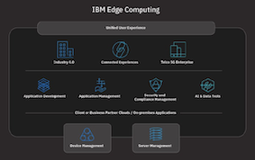
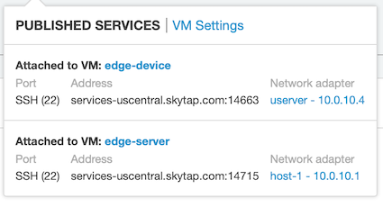
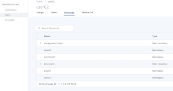
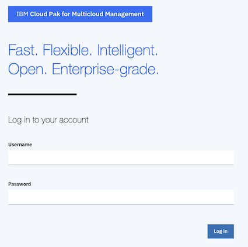
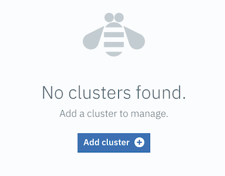
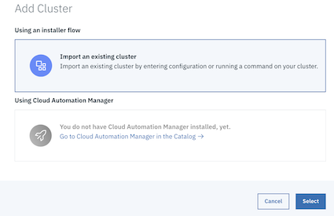
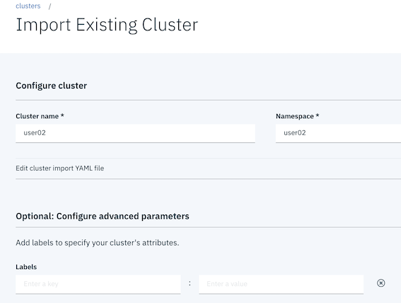
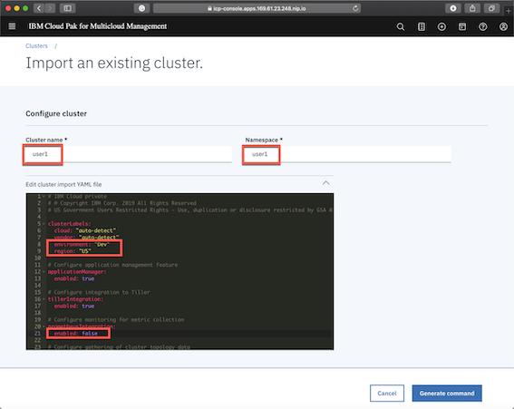

# Edge Server Lab



<!-- TOC -->

- [Edge Server Lab](#edge-server-lab)
  - [Connect to your environment](#connect-to-your-environment)
  - [Adding a new Edge Cluster](#adding-a-new-edge-cluster)
  - [Connect to the Edge Hub Cluster](#connect-to-the-edge-hub-cluster)
  - [Import the Edge cluster](#import-the-edge-cluster)
  - [Explore the cluster import YAML](#explore-the-cluster-import-yaml)
  - [Generate and execute the Operator CURL Command](#generate-and-execute-the-operator-curl-command)
    - [Observe Operator command progress and results.](#observe-operator-command-progress-and-results)
  - [Summary](#summary)
  - [Proof point](#proof-point)

<!-- /TOC -->

In this exercise, we will connect an `Edge profile` (small) Kubernetes cluster to our Edge Hub server. This is native `Multicloud Manager` capability, but over time this will be more Edge focussed.

This process uses the Kubernetes [Operator Framework](https://github.com/operator-framework) which is becoming an important part of Kubernetes workload management.

## Connect to your environment

Get the address and port from your SkyTap instance and then use `putty` or `ssh` to connect to your edge server.



`https://fs20edgem.169.62.229.212.nip.io:8443`

`admin / grey-hound-red-cardinal`

## Adding a new Edge Cluster

For this exercise you must use your own user account on the Edge cluster. You will be issues with details before the labs starts, but for this document, I will use `user02`.

The password for all the Edge cluster accounts is `ReallyStrongPassw0rd`

This process uses the [Kubernetes Operator Framework](https://github.com/operator-framework/getting-started) which is becoming more important for the management of K8S workloads.

When we federate a new cluster, the user account needs access to the cluster that will be used to connect to the cluster, and for deployment exercises, it will need access to namespaces representing entitlement and content.



## Connect to the Edge Hub Cluster

Login in with your supplied details - in my case `user02` `ReallyStrongPassw0rd`



`Hamburger` > `Clusters` then `add cluster`



## Import the Edge cluster

Select `import and existing cluster` and then press the `select` button



Make sure that the `namespace` that you use is the same as your userid. In our case `user02`. This is because this account has been authorised to use this `namespace` when it was configured before the lab started. Please use the same userid for the cluster name so that we can keep track of the teams.



## Explore the cluster import YAML

Uncomment the cluster labels and add some more.

Also turn set `Prometheus` integration to `false` for now. This is not normal operation, but uses unnecessary resources for this exercise.



## Generate and execute the Operator CURL Command

Finally generate the Command to perform the federation.

.

Copy this command into your clipboard.


Connect to your Edge Cluster Instance, something like this .... but get the details from your own 'edge-server' instance from `SkyTap`

```
ssh localuser@services-uscentral.skytap.com -p 12345
localuser@services-uscentral.skytap.com's password:
Welcome to Ubuntu 16.04.6 LTS (GNU/Linux 4.4.0-159-generic x86_64)
.
Last login: Mon Jan 13 10:41:38 2020 from 217.155.198.195
localuser@edge-server:~$
```

Now paste your copied command into your Edge server Terminal session and execute it.


### Observe Operator command progress and results.

You will of course be running these commands on your Edge Server and not the hub.

If you look at the cluster `pods` on your Edge cluster after a while you will see ...

```
localuser@edge-server:~$ kubectl get pods -n multicluster-endpoint
NAME                                                  READY   STATUS        RESTARTS   AGE
endpoint-appmgr-66f667b747-4gzr8                      2/2     Running       0          33m
endpoint-appmgr-helm-crd-68ddc687d5-w5kqp             2/2     Running       0          3d5h
endpoint-component-operator-5f99c5585-628k8           1/1     Running       2          3d5h
endpoint-connmgr-6d46fcfdbd-cnvcb                     1/1     Running       0          33m
endpoint-policyctrl-6bfc8b86d5-6h7z5                  2/2     Running       0          33m
endpoint-search-64c446c455-x2mvt                      1/1     Running       0          33m
endpoint-svcreg-coredns-6b4cc779f8-dxhtt              1/1     Running       0          3d5h
endpoint-svcreg-dc69bf8bd-bfqlg                       1/1     Running       0          33m
endpoint-topology-weave-collector-7d56cc4f5b-2gpg8    1/1     Running       0          33m
endpoint-topology-weave-scope-app-66bc8c954b-qc477    2/2     Running       0          3d5h
endpoint-topology-weave-scope-rspfd                   1/1     Running       0          3d5h
endpoint-workmgr-75fbf96f56-wcp4p                     1/1     Running       0          33m
ibm-multicluster-endpoint-operator-7d7f957bbb-htrjp   1/1     Running       0          3d5h

```

Finally look at the available clusters through the Edge Hub GUI and you will see you registered cluster.


This completes this exercise.

## Summary

We have federated our Edge cluster to the MCM Hub cluster. We have tagged the Edge cluster with labels that represent it's unique characteristics. These can be used to target deployments.

## Proof point

# Provide some guidance here.!!!

Install a HELM chart on our federated Edge cluster.
