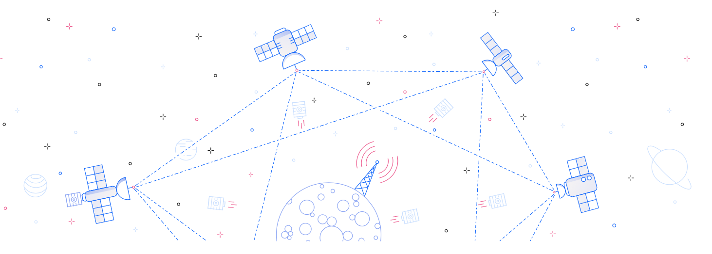

# OnTheEdge - Edge Computing - FastStart 2020

Faststart 2020 lab materials providing an introduction to IBM Edge Computing

<!-- TOC -->

- [OnTheEdge - Edge Computing - FastStart 2020](#ontheedge---edge-computing---faststart-2020)
- [Learning Objectives](#learning-objectives)
- [Some Advice](#some-advice)
- [Introductory materials](#introductory-materials)
- [Assumed prerequisites](#assumed-prerequisites)
- [Cookbook Index](#cookbook-index)
- [Optional Activities](#optional-activities)
- [ToDo](#todo)

<!-- /TOC -->

# Learning Objectives

- Showcase IBM Edge Capabilities to manage both edge servers and devices
- Position IEC for managing different types of workloads:
    e.g. analytics (AI) and business logic  or middleware (Istio/Kafka, etc)
- Inspire the audience to think of potential use-cases in their industries

# Some Advice

This lab guide is not designed to be a `cut` and `paste` exercise. If this is what you do, then the learning value will be limited. Please use the short time you have to read, think and discuss with your colleagues so that you are ready for what is to come.

Have fun!

**Be patient!**

There is some latency in these labs, be patient and allow time for your changes to come into effect.

1. If you Edge Hub GUI goes blank, then go `Hamburger menu` > `Edge Computing`
2. Use `unique` names for your services, nodes and policies as we are working in a multi tenant environment.

**Do this now!**

Start both of your SkyTap VMs now to allow them to initialise.

# Introductory materials

[Edge Computing in 2 minutes](https://youtu.be/AF5ZkcnptMs)

[What is Edge Computing?](https://youtu.be/cEOUeItHDdo)

[DevOx Belgium - developing for the Edge](https://youtu.be/CCWbVjVqH20)

[IBM Edge Computing Technical demo](https://ibm.box.com/s/ela8d52klvba7qwx21fewln4fqfv2kcc)

[IBM Edge Node Patterns](https://ibm.box.com/s/6ik3zs0a5bh4swakywa5v90kmzf8ieik)

[IBM Edge Node Placement policy](https://ibm.box.com/s/rs2vftcch7xtszc31e7kakxa1mpuvk4a)

[Edge Node Management](https://ibm.box.com/s/1t8q4v1z7nxb5fhbzo0ajs7i0u1xykbd)

[Edge Installation](https://ibm.box.com/s/pwgvv5du2hji6cick2getbx6108ddbgl)

[Product manuals](https://www.ibm.com/support/knowledgecenter/SSFKVV_3.2.1/kc_welcome_containers.html)

# Assumed prerequisites

1. A Mac or Linux based desktop. If you are a Windows user then find a suitable team member.
2. Basic command line Linux skills

# Cookbook Index

0. [Connecting to the Lab environment](./ConnectToLabEnvrionment.md)

1. [A Tour of the Edge web console](./ConsoleTour.md)

2. [Edge Device Storyboard](./EdgeDeviceStoryboard.md)
3. [Edge Device Lab](./EdgeDeviceLab.md)

4. [Edge Server Storyboard](./EdgeServerStoryboard.md)
5. [Edge Server Lab](./EdgeServerLab.md)

# Optional Activities

1. [Building a development environment on your Mac](./BuildingDevEnvironment.md)

# ToDo

- Interact with application
- Connect to Edge server
- Deploy HELM Chart to Edge Server.
